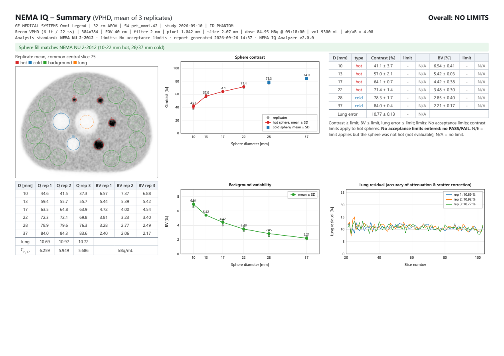

# NEMA IQ Analyzer

A single, self-contained HTML file (`NEMA_IQ_Analyzer.html`) for the analysis of the **NEMA NU 2 Image Quality test**
(IEC/NEMA body phantom: sphere contrast, background variability, lung residual) from PET DICOM images, according to
**NEMA NU 2-2012** or **NEMA NU 2-2018**.

- Runs locally in the browser (Chrome, Edge, Firefox). No installation, no internet connection, no external libraries.
- No data leave the computer: DICOM files are read and processed in the browser's memory.
- Produces a printable A4 report (PDF via the browser's print dialog) plus CSV/JSON/HTML exports.

> **Not a medical device.** This software is provided for quality-assurance work by qualified medical physicists, without
> warranty of any kind. Verify the results, and follow the manufacturer's test procedure and acceptance criteria.

## Download

The program is the single file [`NEMA_IQ_Analyzer.html`](NEMA_IQ_Analyzer.html): download it (on GitHub: open the file,
then *Download raw file*, or take it from the *Releases* page) and open it in the browser. Nothing else is needed.
An example report of an anonymised phantom study is in [`docs/example_report.pdf`](docs/example_report.pdf).
`SHA256SUMS.txt` lists the checksums of all files of the release.

## Quick start

1. Open `NEMA_IQ_Analyzer.html` (double-click).
2. **1 · DICOM data** — click *Select DICOM folder…* and choose the exported study folder, or drag the folder onto the page.
   Browsers do not accept a typed path. Sub-folders are read. The series table lists every series. Attenuation-corrected
   PET series of one reconstruction are ticked as replicates. When a study contains several reconstructions of the same
   acquisitions, choose one in *Reconstruction*; run again with another choice for the next report.
3. **2 · Analysis settings**
   * *NEMA standard*: NU 2-2018 (all six spheres hot; lung slices within 30 mm of the insert ends excluded) or
     NU 2-2012 (10–22 mm hot, 28/37 mm cold; 10 mm exclusion). Choose the edition your acceptance protocol uses.
   * *Sphere : background ratio*: the true activity-concentration ratio of the fill (nominal 4.00).
   * *Scanner profile* (optional): auto-detected from the DICOM header, or chosen from the list. A profile identifies the
     system and may provide **published reference values** that are shown for comparison. They are never used as limits.
   * *Acceptance limits*: none (results without PASS/FAIL), entered by hand, or loaded from a JSON file. Take the values
     from the manufacturer's documentation or your acceptance protocol. *Save these limits as JSON* stores them for re-use.
   * *Baseline* (optional): your own earlier result (e.g. the acceptance test), loaded from JSON. Create it with
     *Save as baseline (JSON)* after an analysis. A baseline is only used when its scanner model matches.
4. Click **Analyse**, then **Print / Save as PDF** (A4 landscape; enable "Background graphics").

## What the program does

* **Localisation (automatic):** phantom body, lung insert (axis and tilt) or, if the phantom has no lung insert, the sphere
  ring and body axis; sphere plane; the six spheres on the 57.2 mm ring, identified by size; hot/cold type of each sphere
  (checked against the selected edition). Each sphere ROI is placed on that sphere's own central slice (or one common slice).
* **ROIs:** sphere ROIs with the sphere inner diameter; 12 background ROIs of each diameter on 5 slices (0, ±1, ±2 cm).
  The NEMA 15 mm wall/sphere margin is reduced in 0.5 mm steps when 12 non-overlapping 37 mm ROIs do not fit; the report
  says so. Lung ROI 30 mm on every slice outside the exclusion zone. ROI means use fractional (sub-pixel) weights.
* **Formulas:** QH = (CH/CB − 1)/(aH/aB − 1) × 100;
  QC = (1 − CC/CB) × 100; BV = SD/CB × 100 over 60 ROIs (K − 1);
  lung error = Clung/CB,37 × 100, averaged over slices; results are the mean (± SD) over replicates.
* **Checks:** fill vs edition, protocol items (acquisition and reconstruction; expected values from the selected profile
  when published), corrections (attenuation, scatter), units, decay correction, measured vs expected background activity
  (from the injected activity and phantom volume in the DICOM header), replicate consistency, CT numbers (if the CT is in
  the folder).
* **Report:** summary; QA details; one page per replicate; appendix with ROI coordinates and lung residual per slice.

### Calculation conventions

* **Lung residual:** Clung,i (30 mm ROI on slice i) is divided by CB,37, the mean of all 60 background
  ROIs of 37 mm (12 ROIs × 5 slices), following the definition of CB in the standard. Because the formula is
  written with a slice index (CB,i), some implementations use a per-slice background instead; results from
  other software may therefore differ slightly. Compare like with like.
* **Replicates:** results are the mean (± SD) over the replicate acquisitions of the same reconstruction. Different
  reconstructions of the same acquisition are never averaged. With a single acquisition no SD is given.
* **Sphere type:** hot/cold is measured from the images. If the fill does not match the selected edition (e.g. 28/37 mm
  cold under NU 2-2018), the spheres are analysed with their measured type and limits for those spheres are reported as
  *not evaluable (N/E)*. A baseline comparison is made only for spheres of the same type.
* **Fill ratio:** contrast uses the ratio entered by the user (use the actual ratio of the preparation, not the nominal
  4.00). NU 2-2018 specifies 4:1 only; NU 2-2012 also allows 8:1.
* **Scan time:** NU 2-2012/2018 prescribe the time per bed position that a 100 cm whole-body scan would take in 30 min
  (T = 30 min × bed step / 100 cm). The QA page shows the bed step implied by the acquired time; the expected time for
  your system follows from its bed step (axial FOV minus overlap) in your clinical protocol.

## Vendor DICOM handling

| Item | Handling |
|---|---|
| Units | `BQML` used directly. Philips `CNTS` converted to Bq/mL with the *Activity Concentration Scale Factor* (7053,1009) of the "Philips PET Private Group" (value 0 or missing → not quantitative). Other units: contrast, BV and lung residual (ratios) are still valid; the measured-vs-expected activity check is skipped. |
| Rescale | Rescale Slope/Intercept applied slice by slice (Siemens and others use a different slope per slice). |
| Decay correction | `START` (to the acquisition start of each series) and `ADMIN` (to the injection time) are both handled in the activity and replicate-consistency checks. |
| Corrections | Series without attenuation correction (Corrected Image lacks `ATTN`) are not offered for analysis. |
| Reconstruction | Read from GE private tags where present; otherwise from Reconstruction Method (e.g. Siemens `PSF+TOF 2i21s`) and Convolution Kernel (e.g. `XYZ Gauss2.00`). |
| Transfer syntax | Uncompressed Explicit/Implicit VR Little Endian and Explicit VR Big Endian. Compressed (JPEG, JPEG-LS, JPEG 2000, RLE, Deflate) and the Philips private syntax are reported with a clear message; re-export uncompressed. |

## Scanner profiles

Profiles are optional. They identify a system from the DICOM header (Manufacturer, Manufacturer's Model Name and, for GE,
the axial FOV) and may contain a published acquisition/reconstruction protocol and published reference values. The
reference values are shown for comparison (purple markers and a Δ column) and are **never** used as PASS/FAIL limits,
except the Discovery IQ "prescribed limits" quoted by Jha et al. 2019, which can be selected explicitly as limits.

| Profile | Auto-detection | Published reference | Remarks |
|---|---|---|---|
| Siemens Biograph mCT (4 rings, TrueV) | `mCT` (not followed by `Flow`) | Karlberg 2016 (NU 2-2007, contrast only) | |
| Siemens Biograph mCT Flow | `mCT Flow` | Rausch 2015 (NU 2-2012) | |
| Siemens Biograph Horizon | `Horizon` | none found | identification only |
| Siemens Biograph Vision 450 | `Biograph…_Vision 3R` | Carlier 2020 | model string from Siemens DCS; 3R → 450 inferred |
| Siemens Biograph Vision 600 | `Biograph…_Vision 4R` | van Sluis 2019 (secondary transcription) | provisional |
| GE Discovery IQ (5 rings) | `Discovery IQ` | Jha 2019, Vallot 2020; Reynes-Llompart 2017 (secondary, provisional) | manufacturer protocol as published by Vallot 2020; optional published limits (Jha 2019) |
| GE Discovery MI, 3 rings | `Discovery MI` + axial FOV | Vandendriessche 2019 | protocol: Vandendriessche 2019 |
| GE Discovery MI, 4 rings | `Discovery MI` + axial FOV | Hsu 2017 (contrast only) | protocol: Chicheportiche 2020 |
| GE Discovery MI, 5 rings | `Discovery MI` + axial FOV | Pan 2019; Zeimpekis 2022 (Gen 2, NU 2-2018) | protocol: Zeimpekis 2022 |
| GE Discovery MI, 6 rings | `Discovery MI` + axial FOV | Zeimpekis 2022 (Gen 2, NU 2-2018) | protocol: Zeimpekis 2022 |
| GE Discovery MI DR | `Discovery MI DR` | none found | protocol: Chicheportiche 2020 |

For the Discovery MI the ring variant is chosen from the GE private axial-FOV tag; if that tag is absent all four
variants are offered and the profile must be selected by hand.

Sources, details and the status of every value are listed in `SOURCES.md`. Additional profiles (other systems, your own
protocol) can be written with `templates/profile_template.json` and loaded with *Load profile JSON…*, or added to
`scanner_profiles.json` and built into the HTML (see *Building from source*).

## Files

| File | Purpose |
|---|---|
| `NEMA_IQ_Analyzer.html` | the program (everything inlined) |
| `scanner_profiles.json` | built-in scanner profiles with sources (editable; rebuild to include changes) |
| `templates/limits_template.json` | acceptance-limit file format |
| `templates/baseline_template.json` | baseline file format (normally created by the program) |
| `templates/profile_template.json` | format for additional scanner profiles (load with *Load profile JSON…*) |
| `SOURCES.md` | the documents behind the analysis rules and the published sources of every profile value |
| `src/` | source code: `core.js` (DICOM reader and analysis), `report.js` (report), `ui.js` (interface), `template.html`, `profiles.js` (generated), `build.py`, `make_sources.py`, `test_core.js` |
| `docs/` | example report (PDF) and page images of an anonymised phantom study |
| `CHANGELOG.md`, `LICENSE`, `CITATION.cff` | release notes, MIT licence, citation metadata |
| `SHA256SUMS.txt` | SHA-256 checksums of all files |

## Limitations

* Uncompressed DICOM only (see *Vendor DICOM handling*); compressed transfer syntaxes are reported but not decoded.
  Axial, non-oblique image series with uniform slice spacing; single-frame (classic) PET image objects.
* One bed position containing the phantom is expected; the phantom must be the IEC/NEMA body phantom with the standard
  sphere set (10–37 mm, 57.2 mm ring).
* Published reference values depend on acquisition, reconstruction and phantom preparation, and are no substitute for
  acceptance limits. Values marked *provisional* come from secondary sources.
* Validation so far: clinical phantom data from two GE systems (Omni Legend 32 cm, NU 2-2012-type fill with lung
  insert, 3 replicates; Discovery MI 4-ring, no lung insert, 2 reconstructions). The analysis agrees with an independent
  Python implementation (contrast within 0.01 percentage points), and with the manufacturer's IQ tool within −0.6 to
  +1.3 points when the manufacturer's slice and ROIs are used. The Siemens and Philips DICOM conventions (units, scale
  factors, decay correction, model names) were implemented from the conformance statements and tested on modified
  copies of GE images only. **Test the program on your own data before routine use.**

## Building from source

`python src/build.py` generates `src/profiles.js` from `scanner_profiles.json` and inlines all sources into
`NEMA_IQ_Analyzer.html`. `python src/make_sources.py` regenerates `SOURCES.md`.
`node src/test_core.js <DICOM folder> [2012|2018] [results.json] [series description]` runs the analysis without a
browser (Node.js; tested with version 26).

## Contributing

Reports of discrepancies, results on other systems (in particular Siemens, Philips, Canon and United Imaging), missing
or corrected published reference values, and new scanner profiles are welcome as GitHub issues or pull requests. Please
cite the table or page of every value you add. **Never attach DICOM files or reports that contain patient or site
identifiers**; describe the header fields instead (Manufacturer, Manufacturer's Model Name, Units, Decay Correction,
Transfer Syntax).

## Licence and disclaimer

Released under the [MIT License](LICENSE). The software is provided "as is", without warranty of any kind; it is not a
medical device and is not intended for diagnosis or treatment. NEMA NU 2 is a standard of the National Electrical
Manufacturers Association; this project is not affiliated with or endorsed by NEMA or by any scanner manufacturer.
Manufacturer and product names are trademarks of their respective owners.

## Citation

Citation metadata are in [`CITATION.cff`](CITATION.cff).
